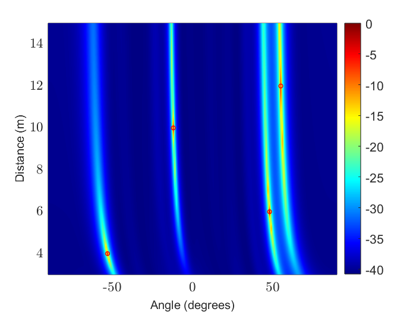

# MUSIC-2D-NearField

This repository implements a 2D source localization method using the classical MUSIC (Multiple Signal Classification) algorithm under near-field conditions. A Uniform Linear Array (ULA) is used, and the steering vector is modeled via a second-order Taylor approximation to account for wavefront curvature, enabling accurate estimation of both Angle of Arrival and range.

## 📌 Features

- Antenna Array: Uniform Linear Array (ULA)
- Localization: 2D (AoA + Range) in near-field
- Signal Model: Free-space, Line-of-Sight (LoS)
- Wavefront Modeling: Taylor expansion (2nd order)
- Output: MUSIC pseudo-spectrum over angle and range grid

## 📌 File Description

| File               | Description                                         |
|--------------------|-----------------------------------------------------|
| `main.m`          | Main script to execute the MUSIC localization        |
| `music.m`         | Core MUSIC algorithm implementation                  |
| `signals.m`       | Generates the received signals matrix (`Y`)         |
| `responsearray.m` | Constructs the array response using Taylor model     |
| `estimation.m`    | Implements AIC criterion to estimate number of sources  |
| `pseudospectrum.pdf` | Example output of the MUSIC pseudo-spectrum     |
| `README.md`       | This documentation                                   |

## 📌 Visualization

Below is an example of the MUSIC pseudo-spectrum for a 2D scenario:

  

The peaks in the spectrum correspond to the estimated positions (AoA, distance) of the sources.
## 📌 Notes

- The number of sources is estimated using the Akaike Information Criterion (AIC).
- Near-field effects are captured via second-order phase modeling.
- The array geometry and propagation model are configurable via `responsearray.m`.

